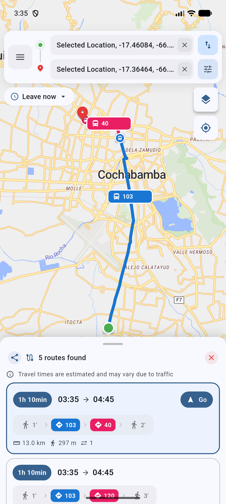

# Trufi Core

[](https://opensource.org/licenses/)
[](https://pub.dev/packages/lint)
[](https://github.com/trufi-association/trufi-app/issues)
[](https://twitter.com/TrufiAssoc)
[](https://github.com/trufi-association/trufi-core/actions/workflows/flutter_test.yml)

A cross-platform multi-modal public transport app built in [Flutter](https://flutter.dev/) by the [Trufi Association](https://www.trufi-association.org/), a social startup. Trufi Core is the foundation that powers public transport apps in cities around the world, using open data (GTFS, OSM) and open source routing engines like [OpenTripPlanner](https://github.com/opentripplanner/OpenTripPlanner).

<p align="center">
  
</p>

## Table of Contents

- [Features](#features)
- [Get the Trufi App for your city](#get-the-trufi-app-for-your-city)
- [Architecture](#architecture)
- [Packages](#packages)
- [Getting started](#getting-started)
- [Contributing](#contributing)
- [Translations](#translations)
- [Complementary projects](#complementary-projects)
- [License](#license)

## Features

- **Multi-modal route planning** — bus, walking, biking and combinations, powered by [OpenTripPlanner](https://github.com/opentripplanner/OpenTripPlanner) (OTP 1.5, 2.4 and 2.8 supported).
- **Live GTFS-RT vehicle positions** — optional real-time bus markers tinted by route color, with live indicators on itinerary cards.
- **Turn-by-turn navigation** for transit and walking legs.
- **Origin/destination search** — online (Photon, Nominatim) and offline (asset-based POI search via [osm-search-data-export](https://github.com/trufi-association/osm-search-data-export)).
- **POI map layers** — render points of interest from GeoJSON or asset bundles.
- **Saved places, fares, feedback, settings, about** — drop-in screens for the most common app sections.
- **Pluggable map engine** via the `ITrufiMapEngine` abstraction — ships with MapLibre GL; the example shows a drop-in `flutter_map` alternative.
- **Push and in-app notifications** for service alerts.
- **Localization-ready** with per-package Flutter `.arb` translations (English, Spanish and German included).

## Get the Trufi App for your city

The mobile application is currently available for the following cities:

- Cochabamba, Bolivia — [Website](https://www.trufi.app), [Google Play](https://play.google.com/store/apps/details?id=app.trufi.navigator), [App Store](https://apps.apple.com/bo/app/trufi/id1471411924)
- Accra, Ghana — [Website](https://www.trotro.app/), [Google Play](https://play.google.com/store/apps/details?id=com.trotro.trotro), [App Store](https://apps.apple.com/bo/app/trotro/id1478620071)
- Addis Ababa, Ethiopia — [Website](https://addismaptransit.com/)

Please [contact the Trufi Association](https://www.trufi-association.org/contact/) to get an app for your city, too. If you'd rather build it yourself, follow the [Getting started](#getting-started) section below.

## Architecture

Trufi Core is a Dart/Flutter monorepo split into focused packages so each app only depends on what it actually uses. Three layers:

- **Core packages** — interfaces, models, routing engines, map rendering, search, notifications, base widgets and design system.
- **Screen packages** — drop-in screens for home, saved places, transport list, fares, feedback, settings and about.
- **Apps** — `apps/example` ties everything together as a runnable reference implementation. Real city apps (e.g. [trufi-app](https://github.com/trufi-association/trufi-app)) follow the same shape.

The example in [apps/example](apps/example) is the canonical place to see how packages compose.

## Packages

### Core

| Package | Description |
| --- | --- |
| [`trufi_core_interfaces`](packages/trufi_core_interfaces) | Shared interfaces and models. |
| [`trufi_core_utils`](packages/trufi_core_utils) | Shared utilities (storage, device id, helpers). |
| [`trufi_core_base_widgets`](packages/trufi_core_base_widgets) | Reusable low-level widgets. |
| [`trufi_core_custom_material`](packages/trufi_core_custom_material) | Theming and Material customizations. |
| [`trufi_core_ui`](packages/trufi_core_ui) | Core UI components and app shell. |
| [`trufi_core_maps`](packages/trufi_core_maps) | Map rendering with a pluggable engine abstraction (ships with MapLibre GL). |
| [`trufi_core_planner`](packages/trufi_core_planner) | GTFS parsing and routing algorithms (Dart only, no Flutter deps). |
| [`trufi_core_routing`](packages/trufi_core_routing) | Route planning with OpenTripPlanner integration (OTP 1.5/2.4/2.8). |
| [`trufi_core_routing_ui`](packages/trufi_core_routing_ui) | Colors, icons and translations for transport modes. |
| [`trufi_core_search_locations`](packages/trufi_core_search_locations) | Origin/destination search bar widgets. |
| [`trufi_core_poi_layers`](packages/trufi_core_poi_layers) | Points-of-interest map layers. |
| [`trufi_core_notifications`](packages/trufi_core_notifications) | Push and in-app notifications. |
| [`trufi_core_navigation`](packages/trufi_core_navigation) | Turn-by-turn navigation for transit and walking legs. |

### Screens

| Package | Description |
| --- | --- |
| [`trufi_core_home_screen`](packages/screens/trufi_core_home_screen) | Home screen with route planning, search and itinerary view. |
| [`trufi_core_saved_places`](packages/screens/trufi_core_saved_places) | Manage favorites, history and custom places. |
| [`trufi_core_transport_list`](packages/screens/trufi_core_transport_list) | Routes list with route details. |
| [`trufi_core_fares`](packages/screens/trufi_core_fares) | Fares / pricing information. |
| [`trufi_core_feedback`](packages/screens/trufi_core_feedback) | External feedback flow with app context. |
| [`trufi_core_settings`](packages/screens/trufi_core_settings) | Settings screen module. |
| [`trufi_core_about`](packages/screens/trufi_core_about) | About / credits screen. |

## Getting started

### Requirements

- Flutter SDK `^3.10.0` (Dart `^3.10.0`)
- iOS deployment target: 13.0+
- An OpenTripPlanner instance for your city (see [Complementary projects](#complementary-projects))

### Run the example

```bash
git clone https://github.com/trufi-association/trufi-core.git
cd trufi-core
flutter pub get
cd apps/example
flutter run
```

### Use Trufi Core in your own app

1. **Bootstrap from the example.** The simplest path is to fork [trufi-app](https://github.com/trufi-association/trufi-app) or copy [apps/example](apps/example) into a new repository — it shows how the packages compose and how to wire your city configuration.

2. **Depend on the packages from git.** In your app's `pubspec.yaml`, replace any local `path:` references with git refs:

   ```yaml
   dependencies:
     trufi_core_home_screen:
       git:
         url: https://github.com/trufi-association/trufi-core.git
         path: packages/screens/trufi_core_home_screen
         ref: main
     trufi_core_routing:
       git:
         url: https://github.com/trufi-association/trufi-core.git
         path: packages/trufi_core_routing
         ref: main
     # ...add the other trufi_core_* packages your app needs
   ```

3. **Configure your city.** Edit your equivalent of [`apps/example/lib/main.dart`](apps/example/lib/main.dart):
   - Set your OpenTripPlanner endpoint (`Otp15RoutingProvider`, `Otp24RoutingProvider` or `Otp28RoutingProvider`).
   - Configure search via `SearchLocationsCubit` — online providers (Photon, Nominatim) and/or offline using a `search.json` generated with [osm-search-data-export](https://github.com/trufi-association/osm-search-data-export).
   - Configure POI layers, saved places, map style, theme, locales and any feature flags (live vehicles, wheelchair toggle, etc.).
   - Replace brand assets in your app's `assets/` folder.

## Contributing

See [CONTRIBUTING](./CONTRIBUTING.md) and our [Code of Conduct](CODE_OF_CONDUCT.md) before contributing.

## Translations

Translations live next to each package as Flutter `.arb` files under `<package>/lib/l10n/` (e.g. [`trufi_core_ui/lib/l10n`](packages/trufi_core_ui/lib/l10n)). To add or update a string, edit the matching `*_en.arb`, `*_es.arb` or `*_de.arb` and run `flutter gen-l10n` (or rebuild — code generation is wired into the package's `l10n.yaml`).

To add a new locale, copy an existing `.arb`, translate it, and reference it in the package's `l10n.yaml`. To override translations from a host app, see the [Custom Translations](https://github.com/trufi-association/trufi-core/wiki/Custom-Translations) guide.

## Complementary projects

- [osm-search-data-export](https://github.com/trufi-association/osm-search-data-export) — Generates offline search data (POIs, streets, junctions). The app uses the json-compact format.
- [osm-public-transport-export](https://github.com/trufi-association/osm-public-transport-export) — Fetches OSM data and generates GeoJSON and additional files.
- [geojson-to-gtfs](https://github.com/trufi-association/geojson-to-gtfs) — Turns generated GeoJSON and additional data into GTFS.
- [gtfs-bolivia-cochabamba](https://github.com/trufi-association/gtfs-bolivia-cochabamba) — Config package that uses *osm-public-transport-export* and *geojson-to-gtfs* to generate a GTFS file for OTP. Use as a template for your city.
- [OpenTripPlanner](https://github.com/opentripplanner/OpenTripPlanner) — Trip planning server that uses GTFS feeds for routing.

## License

Copyright 2020-present — [Trufi Association](https://www.trufi-association.org/)

This program is free software: you can redistribute it and/or modify it under the terms of the [GNU General Public License version 3](./LICENSE) as published by the Free Software Foundation. This program is distributed in the hope that it will be useful, but WITHOUT ANY WARRANTY; without even the implied warranty of MERCHANTABILITY or FITNESS FOR A PARTICULAR PURPOSE. See the GNU General Public License for more details.
